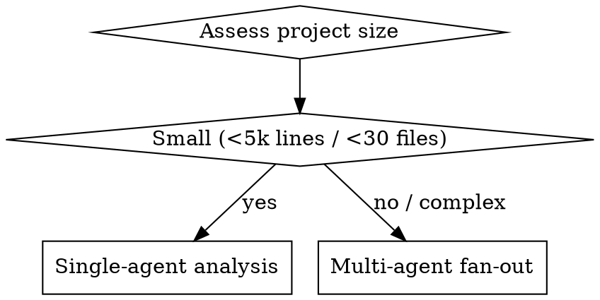

# Reverse-Engineer Spec

## Overview

Reads an existing project — any type: code repo, data pipeline, IaC, or mixed — and produces a structured Markdown document with three sections:

1. **Inferred Spec** — what the project was originally supposed to do, reconstructed from code, config, tests, and structure
2. **Flaw Report** — design problems found in the current state, each with the root cause and downstream impact
3. **Clean Rebuild Brief** — a revised spec with no inherited flaws, ready to hand to `superpowers:writing-plans`

## When to Use

- You have an existing project and want to rebuild it correctly from scratch
- You inherited a codebase and need to understand what it was meant to do
- You suspect the current design accumulated tech debt through patching
- You want a spec to hand into `superpowers:brainstorming` or `superpowers:writing-plans`

**Do not use for:** Simple code review (use `/code-review`), or when you only need to understand what the code does without producing a rebuild spec.

## Analysis Strategy (Adaptive)



**Single-agent:** Run all four analysis passes sequentially in one context.

**Multi-agent (large/complex projects):** Dispatch parallel specialist agents:
- **Structural agent** — file tree, naming, module boundaries, coupling
- **Git history agent** — commit timeline, patch commits, late additions
- **Code quality agent** — anti-patterns, duplication, workarounds, naming breaks
- **Config/test agent** — CI/CD, infra, test coverage, config drift

Synthesise all agent outputs before writing the report.

## Four Analysis Passes

Run all four passes regardless of strategy. Each looks for different evidence.

### Pass 1 — Structural Archaeology

What the project's shape tells you about its original intent:

- Entry points: what is the public surface?
- Module/folder names: what concepts were in scope at design time?
- Naming breaks: where does naming style change? (signals a new contributor or a post-build addition)
- `v2`, `_old`, `_new`, `legacy` in names: explicit evidence of rework
- Wrapper layers around existing code: bolt-on additions
- Circular dependencies or unexpected coupling: design pressure not resolved at design time

### Pass 2 — Git History Analysis (if available)

Reconstruct the build timeline:

1. Find the initial bulk commit (large, often poorly-messaged)
2. Note all commits that add whole new modules or change architecture after that point
3. Flag commits with messages like: `fix`, `hotfix`, `forgot`, `oops`, `workaround`, `add missing`, `should have done`, `patch`, `temp`, `hack`
4. For each flagged commit, document:
   - What was added/changed
   - What it implies was missing from the original design
   - What design consequence followed

**If no git history:** Skip to Pass 3. Note absence in the report.

### Pass 3 — Code-Level Signals

Look for structural tells that something was bolted on:

| Signal | What it implies |
|--------|----------------|
| Comment: `# TODO: refactor this` | Known debt, never resolved |
| Comment: `# added because X didn't handle this` | Patch for missing design |
| Comment: `# workaround for bug in Y` | External constraint not originally scoped |
| Config flags: `ENABLE_LEGACY_PATH=true` | Backwards-compat shim from later change |
| Duplicate logic with slight variation | Feature added twice from two directions |
| Overly generic function name wrapping specific logic | Abstraction added after the fact |
| Exception handler that catches and ignores silently | Edge case discovered in production, not at design |
| Import of a module only used in one place, deep in logic | Late-added dependency |

### Pass 4 — Design Flaw Classification

For every flaw found, classify it:

| Flaw Type | Description |
|-----------|-------------|
| **Missing stage** | A pipeline/process step not included originally; added later |
| **Wrong abstraction level** | Module does too much or too little; forced split or merge later |
| **Premature coupling** | Two concerns merged early; painful to separate |
| **Missing contract** | No validation/schema at a boundary; added as hotfix |
| **Scope creep scar** | Feature added without revisiting the original design |
| **Backwards-compat debt** | Old path kept alive to avoid breaking callers |
| **Inverted dependency** | High-level module depends on detail; discovered via testing pain |

## Output Folder

After analysis, create a folder called `reverse-engineering-new-project/` **in the same parent directory as the source project** (i.e. a sibling folder, not inside the project). Everything the user needs to start a clean rebuild goes in this folder — they can open the folder and have a complete starting point.

For example, if the source project is at `C:\Workspace\MyApp`, create the folder at `C:\Workspace\reverse-engineering-new-project`.

The folder must contain:

1. **`spec.md`** — the three-section reverse-engineered spec document (structure below)
2. **Useful reference files copied from the source project** — see selection rules below

### What to Copy

Copy files that give the new project a head-start without inheriting flaws. Use this decision table:

| File type | Copy if... | Don't copy if... |
|-----------|-----------|-----------------|
| Architecture / design docs | Documents the intended design | Describes the actual broken implementation |
| API contracts (OpenAPI, proto, GraphQL schema) | Defines the public surface | Tightly coupled to internal implementation details |
| Data models / DB schemas | Defines core domain entities | Contains migration patches or legacy columns |
| `.env.example` / config templates | Lists required environment variables | Contains legacy/deprecated keys |
| Brand assets (logos, style guides, colour palettes) | Needed for UI work | N/A — always copy if present |
| Test fixtures / seed data | Defines expected inputs/outputs | Tests written for the broken design |
| Dependency manifests (`package.json`, `pyproject.toml`, `requirements.txt`) | Shows what the project needs | Only copy the dependency list section — not scripts or configs tied to old structure |
| Voice profiles, prompt templates, personas | Defines reusable content identity | N/A — always copy if present |
| CI/CD configs | Project has good pipelines worth keeping | Pipeline embeds broken build steps |
| README / docs | Explains domain concepts and terminology | Describes the old broken architecture |

**When in doubt, copy.** The user can delete what they don't need. Missing a useful file costs more than including an extra one.

**Never copy:**
- Source code files (`.py`, `.ts`, `.js`, `.go`, etc.) — the rebuild starts fresh
- Migration scripts or schema patch files
- Build artefacts, compiled output, `node_modules`, `.venv`, `dist/`, `build/`
- Secrets or `.env` files with real values
- Log files, database files (`.db`, `.sqlite`)

### Folder Layout

```
reverse-engineering-new-project/
  spec.md                    # The three-section reverse-engineered spec
  [copied reference files]   # Flat or minimal sub-structure matching source
```

Preserve sub-folder structure only where it aids navigation (e.g. `assets/logos/` is worth keeping; `backend/db/migrations/` is not).

### After Creating the Folder

Tell the user:
- Path to `spec.md`
- List of files copied and a one-line reason for each
- List of file types explicitly excluded and why

---

## Output Document Structure

Write `spec.md` using this exact structure:

```markdown
# Reverse-Engineered Spec: [Project Name]

> Analysed: [date]
> Project type: [software / pipeline / IaC / mixed]
> Git history available: [yes/no]

---

## Part 1: Inferred Original Specification

### Purpose
[1–3 sentences: what this project was meant to do]

### Inputs
[what the system accepts — data, events, requests, files]

### Outputs / Outcomes
[what the system produces]

### Core Capabilities (as originally designed)
- [capability 1]
- [capability 2]
- ...

### Constraints (inferred)
- [constraint 1 — e.g. "designed for single-tenant use"]
- ...

### What was explicitly NOT in scope (inferred)
- [e.g. "no authentication layer — assumed pre-authenticated callers"]
- ...

---

## Part 2: Flaw Report

> Each flaw includes: what it is, how it was detected, why it happened, and what it cost.

### Flaw 1 — [Short title]

**Type:** [flaw type from classification table]
**Detected via:** [git history / structural / code signal / config]
**What happened:** [factual description]
**Root cause:** [what was missing or wrong at design time]
**Cost:** [what had to be done to work around it, and why that made things worse]

### Flaw 2 — [Short title]
[... repeat for each flaw]

---

## Part 3: Clean Rebuild Brief

> This section is the clean spec. All flaws have been resolved. It is ready to pass to `superpowers:writing-plans` or `superpowers:brainstorming`.

### Purpose
[refined statement of purpose — same goal, no inherited constraints]

### Inputs
[clean input definition]

### Outputs / Outcomes
[clean output definition]

### Architecture Decisions (recommended)
- [decision 1 and why it resolves a specific flaw]
- [decision 2 ...]

### Capabilities
- [capability with flaw resolved]
- ...

### Explicit Out-of-Scope
- [clear boundaries — prevents scope creep scars recurring]

### Suggested First Steps
1. [first thing to design/build]
2. ...
```

## Common Mistakes

| Mistake | Fix |
|---------|-----|
| Describing what code does instead of what it was meant to do | Ask: "what problem was this solving?" not "what does this function do?" |
| Listing every code smell as a flaw | Only flag flaws with a design origin — style issues belong in code review |
| Writing a flaw report with no root cause | Every flaw needs a "why it happened at design time" — without that the rebuild will repeat it |
| Skipping git analysis because history looks clean | Clean history can still show staging commits; look at file creation dates |
| Writing the rebuild brief as a copy of the inferred spec | The rebuild brief should resolve every flaw — if it doesn't, the flaw section was wasted |

## Integration with Superpowers

After generating the output document:

1. **To rebuild from scratch:** Hand Part 3 to `superpowers:writing-plans` — it is already formatted as a spec
2. **To workshop the design first:** Hand Part 3 to `superpowers:brainstorming` — include the flaw list as anti-goals
3. **To have it built immediately:** Hand Part 3 to `superpowers:subagent-driven-development` with Part 2 as a constraints file

## Example Flaw Entry

> Pipeline project. Git shows an initial commit with ingestion + transformation + output stages. Six weeks later, a commit adds a `validate_schema` module.

**Flaw: Missing validation stage**
- **Type:** Missing stage
- **Detected via:** Git history (commit 3f9a2c: "add schema validation — was failing silently on bad records")
- **What happened:** Data entered the transformation stage without schema validation. Bad records caused silent failures in downstream consumers.
- **Root cause:** Validation was not identified as a first-class pipeline stage at design time. It was treated as the caller's responsibility.
- **Cost:** The validation module was bolted onto the transformation stage rather than standing alone, creating a coupling between two concerns. Transformation tests now depend on validation logic. Any change to the schema requires touching the transformation layer.
